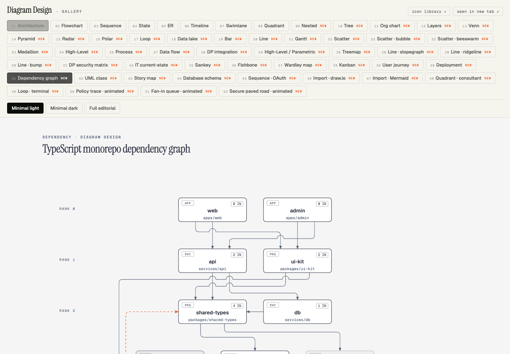

# Original skill import acceptance — 2026-10-01

This is historical evidence from tutoria-hub/agent-library before migration.
Its `bin/library` commands and provider wiring describe that source repository.
For AlesSystems/Skills checks, see [the migration evidence](../work/poteto/skills-migration/acceptance.md).

The source update adds software opportunity discovery and JavaScript product-demo skills, pinned Codex adapters for Poteto and Impeccable, and the diagram-design 2.6.12 guides and gallery. New diagram resources live beneath the loaded skill rather than a separate `skills/craft` tree.

Verification before merge:

- `bin/library validate --strict`: 58 catalog entries pass.
- Bundled skill validator: software-idea-discovery, product-demo-js, and poteto-mode pass.
- `python3 tests/test_diagram_design.py`: routed guide/gallery files resolve; chained Mermaid edges and compact labels pass.
- Independent parser review: 1,548 baseline-supported chained-edge variations agree with base `27f5191`.
- Diagram `self_check.py`: all 148 example HTML files pass safety and accessibility checks.
- Poteto fingerprint verification: 68 skills, 187 files, and 95 routes match pinned commit `7366ac128bdf95f45e6734f412b49a4031800169`.
- Prepared Poteto executable toolkit: 58 Bun tests and four Python integration checks pass. Strict TypeScript checks cover both watch-pr and the authored GitHub frontier adapter/tests.
- Tutoria desk tests: all 11 pass against tracked adapter sources. Live Grok verification has eight environment failures because this host has no installed `tutoria-desk.md` or `pstack-models.md` rules; Grok installation is outside the Codex import.
- Software discovery: five simulated interview/assessment cases pass. Live research retrieval was not exercised.
- Independent reviews cleared the resource-placement and parser regressions; both upstream submodules remain clean.

The library doctor still reports missing Claude links for impeccable, product-demo-js, and software-idea-discovery. These provider-specific links are outside the Codex import. Codex uses source links; runtime/plugin caches and upstream files are not authored or copied.

The pinned Impeccable Codex bundle must be generated with `node adapters/codex/import-impeccable.mjs` after initializing its submodule. Poteto executable support is prepared in disposable task scratch outside canonical and provider directories. Neither adapter enables automations, hooks, external messages, or live mode merely by being imported.

The public Remotion source example and its separate acceptance evidence live in AlesSystems/Skills. Licensed raw music and generated media are excluded from that Git repository.

